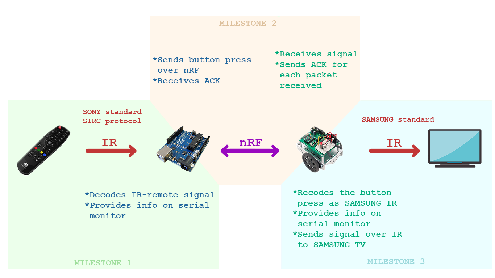

# Infrapuna puldi repiiter-konverter

**Vahendid:** robotikomplekt + Sony pult + Arduino moodul + lisa nRF moodul

**Tulemus:** Arduino moodul võtab vastu Sony infrapuna signaali (erinev loogika Samsungist) ning tuvastab vastuvõetud nupu. Seejärel edastab vastuvõetud nupu kohta informatsiooni läbi jadaliidese monitori kui ka üle nRF raadioside mooduli robotile. Robot võtab üle nRF raadioside mooduli vajutatud nupu informatsiooni vastu ning kodeerib nupu informatsiooni Samsungi standardi järgi ning saadab infrapuna LEDi kasutatud signaali välja. Väljasaadetud signaali saab katsetada kooli Samsungi televiisoritel.

**Lai ülevaade projektist:**

**Hetkeseis masteris:**

- [x] Milestone 1
  - [x] Pult saadab SONY standardiga signaali
  - [x] Arduino moodul võtab puldilt signaali vastu
  - [x] Arduino moodul dekodeerib puldi signaali 
- [x] Milestone 2
  - [x] Saadab signaali üle nRF BotBotile
  - [x] BoeBot võtab signaali vastu
  - [x] ACK vahetus mooduli ja BoeBot vahel
- [x] Milestone 3
  - [x] Rekodeerib üle nRF saadud signaali Samsungi standardi IR signaaliks
  - [x] Saadab signaali IR LEDiga Samsung telerile

# Brighstar Remotes br100p kasutus

**Et Sony signaali saata:**

1. Hoida 'setup' nuppu puldil nii kaua, kuni tuluke jääb punaseks 
2. Vajutada puldil 7-0-0 
3. Seejärel jadaliideselt vaadata, kas lööb #FFFFFFFFF ette, kui vajutada mingit nuppu. Kui jah, siis uuesti 'setup' vajutada ja seejärel sisestada puldil 6-0-5.

# Kasutatud välised teegid

1) Arduino-IRremote: https://z3t0.github.io/Arduino-IRremote/

2) RF24: https://tmrh20.github.io/RF24/